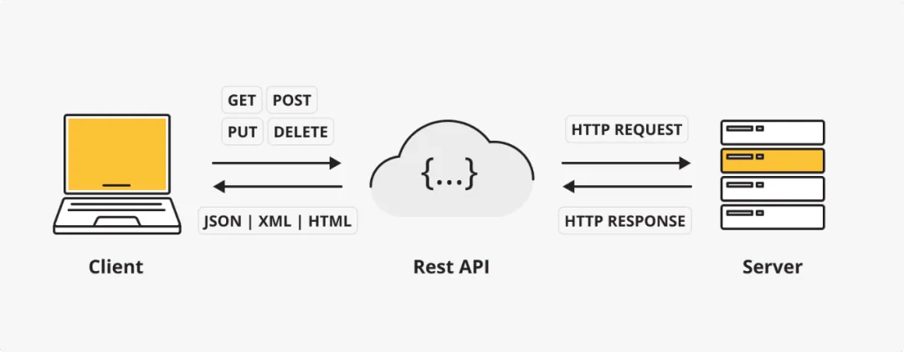
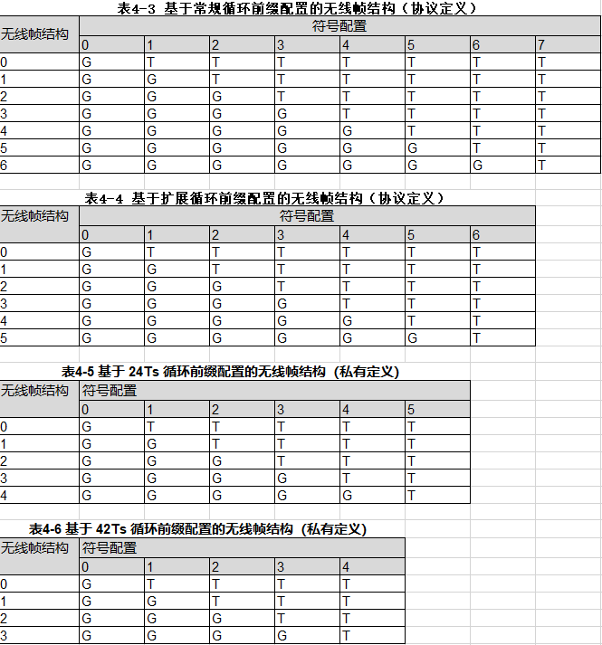

# 微泰星闪网关API指南

REST API（Representational State Transfer Application Programming Interface）是一种基于HTTP协议的软件架构风格，用于构建网络应用程序接口。




## 基础信息

* **基础路径**：`/api/v1`
* **数据格式**：请求 / 响应均使用 JSON
* **鉴权方式**：`Authorization: Bearer <token>`
* **状态码规范**：
  * 200 OK：请求成功
  * 201 Created：资源创建成功
  * 400 Bad Request：请求参数错误
  * 401 Unauthorized：未认证（Token 无效 / 缺失）
  * 403 Forbidden：无权限
  * 404 Not Found：资源不存在
  * 500 Internal Server Error：服务器错误

| HTTP 方法 | 作用   | 对应操作  | 类比   |
| ------- | ---- | ----- |:----:|
| GET     | 获取数据 | 读取    | 获取参数 |
| POST    | 设置数据 | 设置/修改 | 设置参数 |

完整请求格式如下：

{method} http://{ip}:{port}/api/v1/{url}

目前{method}支持GET,POST

直连星闪设备默认{ip}为192.168.99.1,{port}为8080，请根据配置文件的实际值修改。

example:

GET http://192.168.99.1:8080/api/v1/nodes

```json
{
	"status":	"success",
	"data":	{
		"nodes":	[{
				"id":	0,
				"type":	0,
				"name":	"Gnode_000",
				"mac":	"06:08:10:00:00:21"
			}, {
				"id":	1,
				"type":	1,
				"name":	"tnode_001",
				"mac":	"06:08:10:00:00:23"
			}, {
				"id":	2,
				"type":	1,
				"name":	"tnode_002",
				"mac":	"06:08:10:00:00:22"
			}]
	}
}
```


## URL方法总览


| method | url                          | 描述                             | 备注 |
| :----: | :--------------------------- | -------------------------------- | ---- |
|        |                              |                                  |      |
|  GET   | /nodes                       | 获取设备节点                     |      |
|  GET   | /nodes/{id}/basicinfo        | 获取单个节点基本信息             |      |
|  GET   | /nodes/{id}/advinfo          | 获取高级信息                     |      |
|  GET   | /nodes/{id}/conninfo         | 获取设备连接信息                 |      |
|  GET   | /nodes/{id}/sle_basicinfo    | 获取sle设备基本信息              |      |
|  GET   | /nodes/{id}/sle_scan         | sle设备扫描                      |      |
|  GET   | /nodes/{id}/sle_show_bss     | 获取sle设备扫描信息              |      |
|  GET   | /nodes/{id}/sle_conninfo     | 获取sle设备连接信息              |      |
|  GET   | /nodes/{id}/sle_trans_config | 获取sle传输配置                  |      |
|  POST  | /nodes/{id}/stats/traffic    | 获取设备流量信息                 |      |
|  POST  | /nodes/{id}/secalg           | 获取协商后的安全密钥算法         |      |
|  POST  | /nodes/{id}/adaptivemcsinfo  | 查询链路当前速率自适应算法模式   |      |
|  POST  | /nodes/{id}/mcsbound         | 获取速率自适应算法的速率调整区间 |      |
|  POST  | /nodes/{id}/traceinfo        | 查看收发流程相关统计信息         |      |
|        |                              |                                  |      |
|  POST  | /nodes/{id}/timesync         | 时间同步                         |      |
|  POST  | /nodes/{id}/scan             | 扫描                             |      |
|  POST  | /nodes/{id}/autojoinNetwork  | 设置自动入网                     |      |
|  POST  | /nodes/{id}/basicinfo        | 设置设备基本信息                 |      |
|  POST  | /nodes/{id}/connect          | 连接                             |      |
|  POST  | /nodes/{id}/disconnect       | 断开连接                         |      |
|  POST  | /nodes/{id}/reboot           | 重启                             |      |
|  POST  | /nodes/{id}/firmware/upload  | 文件上传                         |      |
|  POST  | /nodes/{id}/firmware/upgrade | 升级操作                         |      |
|  POST  | /nodes/{id}/aifh             | 开启干扰检测和避让(仅G支持)      |      |
|  POST  | /nodes/{id}/chanswitch       | G节点整个网络信道切换(仅G支持)   |      |
|  POST  | /nodes/{id}/advinfo          | 设置高级信息                     |      |
|  POST  | /nodes/{id}/restore          | 恢复出厂设置                     |      |
|  POST  | /nodes/{id}/adaptivemcs      | 设置链路速率自适应算法为固定模式 |      |
|  POST  | /nodes/{id}/clearschmcs      | 恢复链路速率自适应算法为自动模式 |      |
|  POST  | /nodes/{id}/mcsbound         | 设置速率自适应算法的速率调整区间 |      |
|  POST  | /nodes/{id}/sle_connect      | sle设备连接                      |      |
|  POST  | /nodes/{id}/sle_basicinfo    | 设置sle设备基本信息              |      |
|  POST  | /nodes/{id}/sle_trans_config | 设置sle传输配置                  |      |
|        |                              |                                  |      |
|  POST  | /user/register               | 用户注册                         |      |
|  POST  | /user/login                  | 用户登录                         |      |
|  POST  | /user/change_pwd             | 修改用户密码                     |      |
|        |                              |                                  |      |
|  GET   | /user/{id}                   | 获取用户信息                     | todo |
|  POST  | /user/{id}                   | 设置用户信息                     | todo |
|  GET   | /admin/{id}                  | 获取管理员信息                   | todo |
|  POST  | /admin/{id}                  | 设置管理员信息                   | todo |
|        |                              |                                  |      |
|  GET   | /group/{gid}                 | 获取组信息                       | todo |
|  POST  | /group/{gid}                 | 设置组信息                       | todo |
|        |                              |                                  |      |
|        |                              |                                  |      |


## URL方法详解

### 获取 AP 列表

* **URL**：`/nodes`

* **方法**：`GET`

* **请求头**：`Authorization: Bearer <token>`

* **请求参数**：无

* **响应**（200 OK）：
  json
  
  ```json
  {
  	"status":	"success",
  	"data":	{
  		"nodes":	[{
  				"id":	0,
  				"type":	0,
  				"name":	"Gnode_000",
  				"mac":	"06:08:10:00:00:21"
  			}, {
  				"id":	1,
  				"type":	1,
  				"name":	"tnode_001",
  				"mac":	"06:08:10:00:00:23"
  			}, {
  				"id":	2,
  				"type":	1,
  				"name":	"tnode_002",
  				"mac":	"06:08:10:00:00:22"
  			}]
  	}
  }
  ```

### 获取单个节点基本信息

* **URL**：`/nodes/{id}/basicinfo`

* **方法**：`GET`

* **请求头**：`Authorization: Bearer <token>`

* **请求参数**：无

* **响应**（200 OK）：
  json
  
  ```json
  {
  	"status":	"success",
  	"data":	{
  		"id":	0,
  		"name":	"tnode_000",
  		"mac":	"06:08:10:00:00:22",
  		"bw":	20,
  		"tfc_bw":	20,
  		"type":	1,
  		"channel":	1875,
  		"rssi":	-23,
  		"ip":	"192.168.99.45",
  		"version":	"v1.1.22_113.B215",
  		"net_manage_ip":	"192.168.99.111",
  		"log_port":	6025,
  		"aj_flag":	0
  	}
  }
  ```
  
  
- **字段说明**：
  
  | 字段          | 类型   | 说     明        | 备注                                                         |
  | ------------- | ------ | ---------------- | ------------------------------------------------------------ |
  | id            | int    | 设备id           |                                                              |
  | type          | int    | 设备类型         | 0：G(SLB)   1:T(SLB)   5:G(SLE)  6:T(SLE)   7:P(SLE)         |
  | name          | char[] | 设备名称         | 长度小于128                                                  |
  | ip            | char[] | ip地址           |                                                              |
  | mac           | char[] | mac地址          |                                                              |
  | version       | char[] | 版本信息         | v{硬件}.{系统}.{软件版本}.{固件版本}                         |
  | channel       | int    | 信道             | [41, 125, 209, 291, 375, 459, 541, 625, 709, 791, <br />1375, 1459, 1541, 1625, 1709, <br />1791, 1875, 1959, 2041, 2125, 2209, <br />2291, 2479, 2563, 2645, 2729, 2813] |
  | bw            | int    | 物理带宽         | [20,40,80]                                                   |
  | tfc_bw        | int    | 业务带宽         | 业务带宽小于等于物理带宽                                     |
  | rssi          | int    | 信号强度         |                                                              |
  | net_manage_ip | char[] | 系统网管ip地址   | 系统级网管管理ip                                             |
  | log_port      | int    | 系统网管日志端口 |                                                              |
  | aj_flag       | int    | 自动入网标志     | 0：关闭自动入网 1：打开自动入网（默认为0）                   |
  

### 获取单个节点高级信息

* **URL**：`/nodes/{id}/advinfo`

* **方法**：`GET`

* **请求头**：`Authorization: Bearer <token>`

* **请求参数**：无

* **响应**（200 OK）：
  json

  ```json
  {
    "status": "success",
    "data": {
  	"id": 0,
      "devid":0,
      "cell_id":1,
      "cc_spos":0,
      "cp_type": 0,
      "symbol_type": 2,
      "sysmsg_period": 0,
      "s_cfg_idx": 0,
      "sec_exch_cap":		0x00000020,
      "sec_sec_cap":		0x07070703,
      "lce_mode":		2,
      "pps_switch":	0,
      "slb_timestamp": {
  			"slb_cnt": 415059,
  			"glb_cnt": 635243213
  	},
  	"wds": {
  		"wds_enable": 1,
  		"wds_mode":1
  	}，
  	"view_mcs":{
  			"data":	[{
  					"user_idx":	1,
  					"ul_mcs":	4,
  					"dl_mcs":	4
  				}, {
  					"user_idx":	2,
  					"ul_mcs":	3,
  					"dl_mcs":	5
  				}]
  	},
  	"real_power": {
  		"real_pow": 0,
  		"exp_pow": 140
  	},
  	"rssi":{
  		"data": [{
  			"user_idx": 1,
  			"rssi": -49,
  			"rsrp": -70,
  			"snr": 33
  		},{
  			"user_idx": 2,
  			"rssi": -49,
  			"rsrp": -70,
  			"snr": 33
  		}]
  	},
  	"fem_check": "normal",
  	"chip_temperature": 62,
  	"DHCP_enable": 1,
  	"range_opt": 0,
  	"acs_enable": 0
    }
  }
  ```

- **字段说明**：

  | 字段             | 类型   | 说     明                            | 备注                                                         |
  | ---------------- | ------ | ------------------------------------ | ------------------------------------------------------------ |
  | id               | int    | 设备id                               |                                                              |
  | devid            | int    | 设备类型                             | 针对多接口设备，默认单接口：0                                |
  | cell_id          | int    | 接入层小区ID                         | 1～20                                                        |
  | cc_spos          | int    | G节点业务载波的位置                  | [0,3]<br/>20M物理带宽：0；<br/>40M物理带宽：0、1；<br/>80M物理带宽：0、1、2、3。 |
  | cp_type          | int    | 循环前缀类型                         | 循环前缀类型：<br/>0：常规循环前缀（短CP，Cyclic Prefix，5Ts）（Ts，time slot）；<br/>1：扩展循环前缀（长CP，14Ts）；<br/>2：24Ts循环前缀；<br/>3：42Ts循环前缀。 |
  | symbol_type      | int    | 无线帧结构类型                       | [1,5]。<br/> cp_type=0<br/>s_cfg_idx=0/1时，取值2～5；<br/>s_cfg_idx=2时，取值1～5，详情请参见表4-3。<br/> cp_type=1<br/>s_cfg_idx=0/1时，取值2～5；<br/>s_cfg_idx=2时，取值1～5，详情请参见表4-4。<br/> cp_type=2<br/>s_cfg_idx=0/1时，取值2～4；<br/>s_cfg_idx=2时，取值1～4，详情请参见表4-5。<br/> cp_type=3<br/>s_cfg_idx=0/1<br/>时，取值2～3；<br/>s_cfg_idx=2时，取值1～3，详情请参见表4-6。 |
  | sysmsg_period    | int    | 系统消息发送周期                     | [0,3]。<br/>0：64超帧；<br/>1：128超帧；<br/>2：256超帧；<br/>3：512超帧。 |
  | s_cfg_idx        | int    | 符号配置索引                         | [0,2]                                                        |
  | exch_cap         | int    | 密钥协商算法能力                     | [1, 0x00000021]<br/>16进制或10进制整形。<br/>以0x或0X开始的整形表示16进制整形；<br/>未以0x/0X开始的整形表示10进制整形。<br/>密钥协商算法能力共用4Byte表示，每4bit编码的算法标识表示一种算法能力，也就是可以支持8种密钥协商算法，1.0协议暂时只定义2个必选算法和2个可选算法，详情请参见表4-7 |
  | sec_cap          | int    | 安全算法能力                         | [1, 0x07070703]<br/>16进制或10进制整形<br/>以0x或0X开始的整形表示16进制整形；<br/>未以0x或0X开始的整形表示10进制整形。<br/>安全算法能力共用4Byte表示，每个字节的8bit编码了不同安全应用场景下的算法能力, 详情请参见表4-8 |
  | lce_mode         | int    | 整个网络的LC层数据传输模式           | T节点不支持该接口<br/>[0, 4]                                 |
  | pps_switch       | int    | PPS信号输出使能状态                  | 0：关闭PPS功能；<br/>1：使能PPS功能。                        |
  | slb_timestamp    | Array  | SLB时钟与平台GLB时钟同时锁存的时间戳 | 返回两个时钟域的时间戳:<br/>slb_cnt的单位为20.833μs，glb_cnt的单位为31.25μs。<br/>slb_cnt的最大值为（65535×48+47）=3,145,727，大约计时65,534,951μs≈65.5s就会发生溢出回绕。<br/>glb_cnt的最大值为264，大约18279450.5423年，可以认为不会溢出回绕。 |
  | wds              | int    | WDS功能使能开关                      |                                                              |
  | view_mcs         | Array  | 用户链路的瞬时速率                   | 打印每个接入用户第二类动态业务的上行/下行瞬时MCS。           |
  | tx_power         | int    | 实际发送功率以及预期值               | 接口返回当前天线口的实际发送功率和预期发送功率。<br/>G节点侧此接口返回的功率值预期为在配置文件中S符号功率的±2dB左右。<br/>T节点侧的预期值根据路损和targetPSD实时计算：在路损偏小场景，T节点发送功率小于5dB时，此接口返回的实际功率不准确；T节点发送功率大于5dB时，此接口返回的实际功率与预期值偏差在±2dB左右。 |
  | rssi             | Array  | 对端的瞬时RSSI/RSRP/SNR信息          | G节点利用此接口可以查询当前所有已接入用户的RSSI/RSRP/SNR瞬时信息，从一定程度上反应了每一个用户到G节点的上行链路状况。<br/>T节点利用此接口可以查询自己接入的G节点的RSSI/RSRP/SNR瞬时信息，从一定程度上反应了G节点到自己的下行链路状况。 |
  | fem_check        | char[] | 芯片外接的FEM状态                    | normal：FEM状态正常；<br/>abnormal：FEM状态异常。            |
  | chip_temperature | int    | 芯片内部温度统计                     |                                                              |
  | DHCP_enable      | int    | 打开对外接口DHCP                     | 0：关闭DHCP；<br/>1：开启DHCP。（默认开启）                  |
  | acs_enable       | int    | 快速干扰检测与避让                   | 0：关闭干扰检测与避让；<br/>1：开启干扰检测与避让。（该参数只支持G节点配置与获取，默认关闭） |
  | range_opt        | int    | 远距离覆盖优化参数                   | 0：关闭远距离覆盖优化；<br/>1：开启远距离覆盖优化。（该参数适用于覆盖优化测试时配置） |



​														

​														

### sle设备扫描

* **URL**：`/nodes/{id}/sle_scan`

* **方法**：`GET`

* **请求头**：`Authorization: Bearer <token>`

* **请求参数**：无

* **响应**（200 OK）：
  json

  ```json
  {
  	"status":	"success",
  	"data":	[{
  			"rssi":	-44,
  			"mac":	"d:0:0:0:0:13"
  		}, {
  			"rssi":	-84,
  			"mac":	"6:8:10:0:0:11"
  		}]
  }
  ```

### 获取SLE设备基本信息

* **URL**：`/nodes/{id}/sle_basicinfo`

* **方法**：`GET`

* **请求头**：`Authorization: Bearer <token>`

* **请求参数**：无

* **响应**（200 OK）：
  json

  ```json
  {
    "status": "success",
    "data": {
      "sle_type": 5,
      "sle_name": "sle_t001",
      "mac": "06:08:10:00:00:32",
      "sle_enable": 1
    }
  }
  ```

### 获取sle设备连接信息

* **URL**：`/nodes/{id}/sle_conninfo`

* **方法**：`GET`

* **请求头**：`Authorization: Bearer <token>`

* **请求参数**：无

* **响应**（200 OK）：
  json

  ```json
  {
    "status": "success",
    "data": [
      {
        "mac": "d:0:0:0:0:12",
        "conn_id": 0
      },
      {
        "mac": "d:0:0:0:0:13",
        "conn_id": 1
      }
    ]
  }
  ```

### 获取sle设备扫描信息

* **URL**：`/nodes/{id}/sle_show_bss`

* **方法**：`GET`

* **请求头**：`Authorization: Bearer <token>`

* **请求参数**：无

* **响应**（200 OK）：
  json

  ```json
  {
    "status": "success",
    "data": [{
        "rssi": -79,
        "mac": "6:8:10:0:0:11"
      }, {
        "rssi": -45,
        "mac": "d:0:0:0:0:13"
      }]
  }
  ```

### 获取sle传输配置

* **URL**：`/nodes/{id}/sle_trans_config`

* **方法**：`GET`

* **请求头**：`Authorization: Bearer <token>`

* **请求参数**：无

* **响应**（200 OK）：
  json

  ```json
  {
    "status": "success",
    "data": {
  		"trans_tcp_port":9981,
        	"trans_udp_port":9982
    }
  }
  ```


### sle设备连接

* **URL**：`/nodes/{id}/sle_connect`

* **方法**：`POST`

* **请求头**：`Authorization: Bearer <token>`

* **请求体**：json

  ```json
  {
      "mac": "d:0:0:0:0:13"
  }
  ```

* **响应**（200 OK）：
  json

  ```json
  {
    "status": "success"
  }
  ```

### 设置自动入网

* **URL**：`/nodes/{id}/autojoinNetwork`

* **方法**：`POST`

* **请求头**：`Authorization: Bearer <token>`

* **请求体**：json

  ```json
  {
      "aj_flag": 0
  }
  ```

* **响应**（200 OK）：json

* **字段说明**

  | 字段    | 类型 | 说明         | 备注             |
  | ------- | ---- | ------------ | ---------------- |
  | aj_flag | int  | 自动入网标志 | 0：关闭；1：开启 |

### 设置单个节点基本信息

* **URL**：`/nodes/{id}/basicinfo`

* **方法**：`POST`

* **请求头**：`Authorization: Bearer <token>`

* **请求体**：json

```json
{
  "type": 0,
  "name": "gnode_01",
  "ip": "192.168.99.1",
  "channel": 2479,
  "bw": 40,
  "tfc_bw": 20,
  "log_port": 6025,
  "net_manage_ip": "192.168.99.11"
}
```


* **响应**（200 OK）：
  json

  ```json
  {
    "status": "success"
  }
  ```

- **字段说明**：

|     字段      |  类型  | 说     明        | 备注                                                         |
| :-----------: | :----: | ---------------- | ------------------------------------------------------------ |
|     type      |  int   | 设备类型         | 0：G(SLB)   1:T(SLB)   5:G(SLE)  6:T(SLE)   7:P(SLE)         |
|     name      | char[] | 设备名称         | 长度小于128                                                  |
|      ip       | char[] | ip地址           |                                                              |
|    channel    |  int   | 信道             | [41, 125, 209, 291, 375, 459, 541, 625, 709, 791, <br />1375, 1459, 1541, 1625, 1709,<br /> 1791, 1875, 1959, 2041, 2125, 2209,<br /> 2291, 2479, 2563, 2645, 2729, 2813] |
|      bw       |  int   | 物理带宽         | [20,40,80]                                                   |
|    tfc_bw     |  int   | 业务带宽         | 业务带宽小于等于物理带宽                                     |
|   log_port    |  int   | 系统网管日志端口 |                                                              |
| net_manage_ip | char[] | 系统网管ip地址   |                                                              |

### 设置单个节点高级信息

* **URL**：`/nodes/{id}/advinfo`

* **方法**：`POST`

* **请求头**：`Authorization: Bearer <token>`

* **请求体**：json

```json
{
    "cell_id":1,
    "cc_spos":0,
    "cp_type": 0,
    "symbol_type": 2,
    "sysmsg_period": 0,
    "s_cfg_idx": 0,
    "auth_password": "12345678",
    "exch_cap": 0x00000020,
    "sec_cap":	0x07070703,
    "lce_mode": 2,
    "pps_switch": 1,
    "rx_thread_switch" : "on",
    "fisa_enable": "enable",
    "tx_power": 250,
    "wds_enable": 1,
    "DHCP_enable": 1,
    "range_opt": 1,
    "acs_enable": 1
}
```


* **响应**（200 OK）：
  json

  ```json
  {
    "status": "success"
  }
  ```

- **字段说明**：

  | 字段             | 类型   | 说     明                  | 备注                                                         |
  | ---------------- | ------ | -------------------------- | ------------------------------------------------------------ |
  | cell_id          | int    | 接入层小区ID               | 1～20                                                        |
  | cc_spos          | int    | G节点业务载波的位置        | [0,3]<br/>20M物理带宽：0；<br/>40M物理带宽：0、1；<br/>80M物理带宽：0、1、2、3。 |
  | cp_type          | int    | 循环前缀类型               | 循环前缀类型：<br/>0：常规循环前缀（短CP，Cyclic Prefix，5Ts）（Ts，time slot）；<br/>1：扩展循环前缀（长CP，14Ts）；<br/>2：24Ts循环前缀；<br/>3：42Ts循环前缀。 |
  | symbol_type      | int    | 无线帧结构类型             | [1,5]。<br/> cp_type=0<br/>s_cfg_idx=0/1时，取值2～5；<br/>s_cfg_idx=2时，取值1～5，详情请参见表4-3。<br/> cp_type=1<br/>s_cfg_idx=0/1时，取值2～5；<br/>s_cfg_idx=2时，取值1～5，详情请参见表4-4。<br/> cp_type=2<br/>s_cfg_idx=0/1时，取值2～4；<br/>s_cfg_idx=2时，取值1～4，详情请参见表4-5。<br/> cp_type=3<br/>s_cfg_idx=0/1<br/>时，取值2～3；<br/>s_cfg_idx=2时，取值1～3，详情请参见表4-6。 |
  | sysmsg_period    | int    | 系统消息发送周期           | [0,3]。<br/>0：64超帧；<br/>1：128超帧；<br/>2：256超帧；<br/>3：512超帧。 |
  | s_cfg_idx        | int    | 符号配置索引               | [0,2]                                                        |
  | auth_password    | char[] | 本小区无线网络的接入口令   | 8Byte～32Byte的ASCII字符。                                   |
  | exch_cap         | int    | 密钥协商算法能力           | [1, 0x00000021]<br/>16进制或10进制整形。<br/>以0x或0X开始的整形表示16进制整形；<br/>未以0x/0X开始的整形表示10进制整形。 |
  | sec_cap          | int    | 安全算法能力               | [1, 0x07070703]<br/>16进制或10进制整形<br/>以0x或0X开始的整形表示16进制整形；<br/>未以0x或0X开始的整形表示10进制整形。 |
  | lce_mode         | int    | 整个网络的LC层数据传输模式 | T节点不支持该接口<br/>[0, 4]                                 |
  | pps_switch       | int    | PPS信号输出使能状态        | 0：关闭PPS功能；<br/>1：使能PPS功能。                        |
  | rx_thread_switch | char[] | 内核接收流程转发分段       | on：关闭RX流程分段；<br/>off：使能RX流程分段。               |
  | fisa_enable      | char[] | 快速干扰感知规避算法的使能 | enable：开启；<br/>disable：关闭。                           |
  | tx_power         | int    | 设置固定功率               | [-310,250]<br/>250表示功率25dBm，125表示功率12.5dBm。        |
  | wds_enable       | int    | 打开WDS功能                |                                                              |
  | DHCP_enable      | int    | 打开对外接口DHCP           | 0：关闭DHCP；<br/>1：开启DHCP。（默认开启）                  |
  | acs_enable       | int    | 快速干扰检测与避让         | 0：关闭干扰检测与避让；<br/>1：开启干扰检测与避让。（该参数只支持G节点配置与获取，默认关闭） |
  | range_opt        | int    | 远距离覆盖优化参数         | 0：关闭远距离覆盖优化；<br/>1：开启远距离覆盖优化。（该参数适用于覆盖优化测试时配置） |

### 设置sle设备基本信息

* **URL**：`/nodes/{id}/sle_basicinfo`

* **方法**：`POST`

* **请求头**：`Authorization: Bearer <token>`

* **请求体**：json

  ```json
  {
      "sle_type": 5,
      "sle_name": "2981_sle_g",
  	"sle_enable": 1
  }
  ```

* **响应**（200 OK）：json

* **字段说明**

  | 字段       | 类型   | 说明        | 备注                                                 |
  | ---------- | ------ | ----------- | ---------------------------------------------------- |
  | sle_type   | int    | sle设备类型 | 0：G(SLB)   1:T(SLB)   5:G(SLE)  6:T(SLE)   7:P(SLE) |
  | sle_name   | char[] | sle设备名称 | 长度<=32byte                                         |
  | sle_enable | int    | sle使能     | 0：关闭sle；1：使能sle                               |

### 设置sle传输配置

* **URL**：`/nodes/{id}/sle_trans_config`

* **方法**：`POST`

* **请求头**：`Authorization: Bearer <token>`

* **请求体**：json

  ```json
  {
      "trans_tcp_port": 9981,
      "trans_udp_port": 9982
  }
  ```

* **响应**（200 OK）：json

* **字段说明**

  | 字段           | 类型 | 说明            | 备注 |
  | -------------- | ---- | --------------- | ---- |
  | trans_tcp_port | int  | tcp传输的端口号 |      |
  | trans_udp_port | int  | udp传输的端口号 |      |

### 获取协商后的安全密钥算法

* **URL**：`/nodes/{id}/secalg`

* **方法**：`POST`

* **请求头**：`Authorization: Bearer <token>`

* **请求体**：json

  ```json
  {"user_mac":"72:04:5f:8e:55:1f"}
  ```

* **响应**（200 OK）：json

  ```json
  {
      "status":    "success",
      "data":    {
          "algorithm":    "0x00000000"
      }
  }
  ```

* **字段说明**：

  | 字段      | 类型   | 说明                               | 备注 |
  | --------- | ------ | ---------------------------------- | ---- |
  | algorithm | char[] | 返回的4Byte（32bit）含义如下：表格 |      |

  | bit[0]～bit[3]                                               | bit[4]～bit[7]                                               | bit[8]～bit[11]                                              | bit[12]～bit[15]                                             | bit[16]～bit[19]                                             | bit[20]～bit[23] | bit[24]～bit[27] | bit[28]～bit[31] |
  | ------------------------------------------------------------ | ------------------------------------------------------------ | ------------------------------------------------------------ | ------------------------------------------------------------ | ------------------------------------------------------------ | ---------------- | ---------------- | ---------------- |
  | 密钥派生函数算法标识                                         | 信令面加密算法标识                                           | 信令面完整性保护算法标识                                     | 用户面加密或者认证加密算法标识                               | 用户面完整性或者认证加密算法标识                             | 保留             | 保留             | 保留             |
  | 0001：GHA1(HMAC-SM3)；<br/>0010：GHA2(HMAC-SHA256)；<br/>else：自定义算法或者预留。 | 0000：不开启信令面加密；<br/>0001：GCA1(ZUC-128)；<br/>0010：GCA2(AES-CTR-128)；<br/>0011：GCA3(AES-CTR-256)；<br/>else：自定义算法或者预留。 | 0001：GIA1(ZUC-128)，MIC：32bit；<br/>0010：GIA2(AES-CMAC-128)，MIC：32bit；<br/>0011：GIA3(AES-CMAC-256)，MIC：64/128bit；<br/>else：自定义算法或者预留 | 0000：不开启用户面加密/认证算法；<br/>0001：GCA1(ZUC-128)；<br/>0010：GCA2(AES-CTR-128)；<br/>0011：GCA3 (AES-CTR-256)；<br/>1001：GAC1(SM4-CCM-128bit)，MIC：32bit；<br/>1010：GAC2(AES-CCM-128)，MIC：32bit；<br/>1011：GAC3(AES-CCM-256)；<br/>MIC：64/128bit；<br/>else：自定义算法或者预留。 | 0000：不开启用户面完整性/认证算法；<br/>0001：GIA1(ZUC-128)，MIC：32bit；<br/>0010：GIA2(AES-CMAC-128)，<br/>MIC：32bit；<br/>0011：GIA3 (AES-CMAC-256)，MIC：64/128bit；<br/>1001：GAC1(SM4-CCM-128bit)，MIC：32bit；<br/>1010：GAC2(AES-CCM-128)，MIC：32bit；<br/>1011：GAC3(AES-CCM-256)，MIC：64/128bit；<br/>else：自定义算法或者预留。 | -                | -                | -                |

### 设置链路速率自适应算法为固定模式

* **URL**：`/nodes/{id}/adaptivemcs`

* **方法**：`POST`

* **请求头**：`Authorization: Bearer <token>`

* **请求体**：json

  ```json
  {
      "user_mac": "72:04:5f:8e:55:1f",
      "res_type": "ddata",
      "dir": "dl",
      "mcs": 20
  }
  ```

* **请求体字段说明**

  | 参数名   | 参数说明    | 参数类型 | 取值范围                                              | 备注                                                         |
  | -------- | ----------- | -------- | ----------------------------------------------------- | ------------------------------------------------------------ |
  | user_mac | 用户MAC地址 | MAC地址  | 合法的MAC地址                                         | 00:00:00:00:00:00：特指所有用户； ff:ff:ff:ff:ff:ff：特指广播用户，对应的是广播业务； else：特定用户。 |
  | res_type | 资源类型    | 枚举     | ddata：第二类数据业务； sdata：半静态第二类数据业务。 | -                                                            |
  | dir      | 业务方向    | 枚举     | dl：下行方向（G链路）； ul：上行方向（T链路）。       | -                                                            |
  | mcs      | 调制编码集  | 枚举     | res_type为ddata或sdata时：[0,31]。                    | -                                                            |

* **响应**（200 OK）：json

  ```json
  {
    "status": "success"
  }
  ```

### 恢复链路速率自适应算法为自动模式

* **URL**：`/nodes/{id}/clearschmcs`

* **方法**：`POST`

* **请求头**：`Authorization: Bearer <token>`

* **请求体**：json

  ```json
  {"user_mac":"72:04:5f:8e:55:1f"}
  ```

* **响应**（200 OK）：json

  ```json
  {
    "status": "success"
  }
  ```

### 查询链路当前速率自适应算法模式

* **URL**：`/nodes/{id}/adaptivemcsinfo`

* **方法**：`POST`

* **请求头**：`Authorization: Bearer <token>`

* **请求体**：json

  ```json
  {
      "user_mac": "72:04:5f:8e:55:1f",
      "res_type": "ddata",
      "dir": "ul"
  }
  ```

* **请求体字段说明**

  | 参数名   | 参数说明    | 参数类型 | 取值范围                                              | 备注                                                         |
  | -------- | ----------- | -------- | ----------------------------------------------------- | ------------------------------------------------------------ |
  | user_mac | 用户MAC地址 | MAC地址  | 合法的MAC地址                                         | 00:00:00:00:00:00：不支持同时查询所有用户，会返回失败；<br/>ff:ff:ff:ff:ff:ff：特指广播用户，对应的是广播业务；<br/>else：特定用户。 |
  | res_type | 资源类型    | 枚举     | ddata：第二类数据业务； sdata：半静态第二类数据业务。 | -                                                            |
  | dir      | 业务方向    | 枚举     | dl：下行方向（G链路）； ul：上行方向（T链路）。       | -                                                            |

* **响应**（200 OK）：json

  ```json
  {
      "status":	"success",
  	"data":	{
  		“user_mac”: "72:ab:11:5c:36:3a",
  		"res_type": "ddata",
  		"dir": "ul",
  		"mcs": 255
      }
  }
  ```

* **响应体字段说明**

  mcs:

  ​	[0,31]：说明该[用户、资源类型、方向]三元组采用的链路速率模式是固定的，且固定速率为对应MCS。

  ​	0xff：说明该[用户、资源类型、方向]三元组采用的链路速率模式是自适应的。

### 获取速率自适应算法的速率调整区间

* **URL**：`/nodes/{id}/mcsboundinfo`

* **方法**：`POST`

* **请求头**：`Authorization: Bearer <token>`

* **请求体**：json

  ```json
  {"user_mac":"72:04:5f:8e:55:1f"}
  ```

* **响应**（200 OK）：json

  ```json
  {
      "status":    "success",
      "data":    {
  		"low_bound"： 0,
  		"up_bound": 30
      }
  }
  ```

* **字段说明**

  | 参数名    | 参数说明          | 参数类型 | 取值范围 | 备注                   |
  | --------- | ----------------- | -------- | -------- | ---------------------- |
  | low_bound | MCS调整区间的下限 | 枚举值   | [0,31]   | 保证low_bound≤up_bound |
  | up_bound  | MCS调整区间的上限 | 枚举值   | [0,31]   | 保证low_bound≤up_bound |

### 设置速率自适应算法的速率调整区间

* **URL**：`/nodes/{id}/mcsbound`

* **方法**：`POST`

* **请求头**：`Authorization: Bearer <token>`

* **请求体**：json

  ```json
  {
  	"user_mac": "72:04:5f:8e:55:1f",
  	"low_bound": 0,
  	"up_bound": 22
  }
  ```

* **请求体字段说明**

  | 参数名    | 参数说明          | 参数类型 | 取值范围      | 备注                                                         |
  | --------- | ----------------- | -------- | ------------- | ------------------------------------------------------------ |
  | user_mac  | 用户MAC地址       | MAC地址  | 合法的MAC地址 | 00:00:00:00:00:00：set接口支持同时配置所有用户；get接口不支持同时查询所有用户，会返回失败；<br/>ff:ff:ff:ff:ff:ff：特指广播用户，对应的是广播业务；<br/>else：特定用户。 |
  | low_bound | MCS调整区间的下限 | 枚举值   | [0,31]        | 保证low_bound≤up_bound                                       |
  | up_bound  | MCS调整区间的上限 | 枚举值   | [0,31]        | 保证low_bound≤up_bound                                       |

* **响应**（200 OK）：json

  ```json
  {
    "status": "success"
  }
  ```

### 查看收发流程相关统计信息

* **URL**：`/nodes/{id}/traceinfo`

* **方法**：`POST`

* **请求头**：`Authorization: Bearer <token>`

* **请求体**：json

  ```json
  {
      "feature": "vip",
      "user_mac": "72:04:5f:8e:55:1f"
  }
  ```

* **请求体字段说明**

  | 参数名   | 参数说明           | 参数类型 | 取值范围                                                     | 备注                                                         |
  | -------- | ------------------ | -------- | ------------------------------------------------------------ | ------------------------------------------------------------ |
  | feature  | 需要跟踪的特性名称 | 枚举     | vip：支持查看dhcp、arp、icmp这些上层协议关键帧的收发统计；<br/>throughput：统计SLB接入层转发流程上关键节点的流量速率；<br/>delay：统计最近10个ICMP报文在SLB接入层的转发流程上几个关键节点之间的时延；<br/>drop：统计SLB接入层转发流程上关键丢包点的丢包数；<br/>mcs：统计SLB接入层发送流程上一定统计时间窗内的链路速率分布；<br/>user_access：记录最近几次入网失败的现场信息。 | -                                                            |
  | user_mac | 用户的MAC地址      | MAC地址  | 合法的MAC地址。                                              | feature配置为vip、throughput、drop时支持输入00:00:00:00:00:00的用户地址查看所有用户的汇总统计数据，当然也支持查看用户级别的统计数据；<br/>feature配置为delay、msc时只支持用户级别的统计数据，不支持输入00:00:00:00:00:00的用户地址；<br/>feature配置为user_access时，只支持00:00:00:00:00:00的用户地址。 |

* **响应**（200 OK）：json

  1、feature:vip（支持查看dhcp、arp、icmp这些上层协议关键帧的收发统计）
  
  ```json
  {
      "status":    "success",
      "data":    {
  		"role": 0,
  		"user_mac": "72:04:5f:8e:55:1f",
      	"protocols":["DHCP", "ARP_REQ", "ARP_RSP", "ICMP"],
  		"feature": "vip",
  		"stats": {
  			"host_tx_h2h": [0, 3, 4, 0],
  			"host_tx_h2d": [0, 3, 4, 0],
  			"dmac_tx_h2d": [0, 3, 4, 0],
  			"dmac_tx_sch_fill_tb": [0, 3, 4, 0],
  			"host_rx_d2h": [2, 4, 3, 0],
  			"host_rx_defrag_compl": [2, 4, 3, 0],
  			"host_rx_deliver": [2, 4, 3, 0]
  		}
      }
  }
  ```
  
  字段说明：
  
  | 字段                 | 类型   | 说明                                                         |
  | -------------------- | ------ | ------------------------------------------------------------ |
  | role                 | int    | 节点角色（0：G，1：T）                                       |
  | user_mac             | char[] | 查询对应节点的MAC(支持00:00:00:00:00:00)                     |
  | feature              | char[] | 跟踪统计特性名称                                             |
  | protocols            | Array  | 跟踪数组对应的数据名称组合                                   |
  | stats                | object | 跟踪统计数据主体                                             |
  | host_tx_h2h          | Array  | host-to-host,同主机内不同虚拟接口间的通信（wt_vap0-to-wt_vap1） |
  | host_tx_h2d          | Array  | host-to-device, 上层协议栈将数据包提交给无线驱动，用于判断是否是上层问题 |
  | dmac_tx_h2d          | Array  | host-to-device,无线驱动的MAC层接收到的数据包                 |
  | dmac_tx_sch_fill_tb  | Array  | 数据包已进入调度器队列，等待被硬件取出并发送                 |
  | host_rx_d2h          | Array  | device-to-host, 无线驱动成功接收到一个来自空口的数据帧，并上报给主机协议栈 |
  | host_rx_defrag_compl | Array  | 主机已完成对分片报文的重组                                   |
  | host_rx_deliver      | Array  | 重组后的完整报文已成功交付给上层协议栈                       |
  
  2、feature:throughput（统计SLB接入层转发流程上关键节点的流量速率,单位为MiB）
  
  ```json
  {
      "status":    "success",
      "data":    {
  		"role": 0,
  		"user_mac": "72:04:5f:8e:55:1f",
      	"feature": "throughput",
      	"host_tx_h2h": "0.0M",
      	"host_tx_h2d": "0.0M",
      	"host_rx_d2h": "0.0M",
      	"host_rx_defrag_compl": "0.0M",
      	"host_rx_deliver": "0.0M"
      }
  }
  ```
  
  字段说明
  
  | 字段                 | 类型   | 说明                                                         |
  | -------------------- | ------ | ------------------------------------------------------------ |
  | role                 | int    | 节点角色（0：G，1：T）                                       |
  | user_mac             | char[] | 查询对应节点的MAC(支持00:00:00:00:00:00)                     |
  | feature              | char[] | 跟踪统计特性名称                                             |
  | host_tx_h2h          | char[] | host-to-host吞吐量，表示主机内部不同虚拟接口之间的通信吞吐量，在点对点通信中通常为0 |
  | host_tx_h2d          | char[] | host-to-device吞吐量，表示从主机发送到无线设备驱动的数据流量 |
  | host_rx_d2h          | char[] | device-to-host吞吐量，表示从无线设备接收到并传递给主机的数据流量 |
  | host_rx_defrag_compl | char[] | 主机完成分片重组后的吞吐量                                   |
  | host_rx_deliver      | char[] | 最终交付给上层协议栈的吞吐量                                 |
  
  3、feature:delay（统计最近10个ICMP报文在SLB接入层的转发流程上几个关键节点之间的时延）
  
  ```json
  {
      "status":    "success",
      "data":    {
      	"role": 0,
  		"user_mac": "72:04:5f:8e:55:1f",
      	"feature": "delay",
          "protocols":["skb1", "skb2", "skb3", "skb4", "skb5", "skb6", "skb7", "skb8", "skb9", "skb10"],
          "stats": {
              "TX_HMAC_FC_Q":[0, 0, 0, 0, 0, 1, 0, 0, 0, 0],
      		"TX_DMAC_LC_Q":[1, 5, 5, 2, 2, 1, 1, 1, 3, 1],
      		"RX_HMAC_DEFRAG":[0, 0, 0, 0, 0, 0, 0, 0, 0, 0],
      		"RX_HMAC_REORDER":[0, 0, 0, 0, 0, 0, 0, 0, 0, 0]
          }
      }
  }
  ```
  
  字段说明
  
  | 字段            | 类型   | 说明                                     |
  | --------------- | ------ | ---------------------------------------- |
  | role            | int    | 节点角色（0：G，1：T）                   |
  | user_mac        | char[] | 查询对应节点的MAC(支持00:00:00:00:00:00) |
  | feature         | char[] | 跟踪统计特性名称                         |
  | protocols       | Array  | 跟踪数组对应的数据名称组合               |
  | TX_HMAC_FC_Q    | Array  | 报文进入主机MAC层流控队列的时间          |
  | TX_DMAC_LC_Q    | Array  | 报文进入设备MAC层低时延调度队列的时间    |
  | RX_HMAC_DEFRAG  | Array  | 主机完成分片重组的时间                   |
  | RX_HMAC_REORDER | Array  | 主机完成乱序重排的时间                   |
  
  4、feature:drop（统计SLB接入层转发流程上关键丢包点的丢包数）
  
  ```json
  {
  	"status":    "success",
      "data":    {
  		"role": 0,
  		"user_mac": "72:04:5f:8e:55:1f",
      	"feature": "drop",
          "protocols":["drop_cnt", "rough_total", "ratio", "vip_drop_cnt"],
          "stats": {
          	"host_tx_fc_drop": [0, 27908, 0, 0],
          	"host_tx_retx_drop": [0, 27908, 0, 0],
          	"host_tx_a2h_drop": [0, 27908, 0, 0],
          	"dmac_tx_distribute_fail": [0, 27911, 0, 0],
          	"dmac_rx_parse_mac_hdr": [122, 2093289, 1/17158, 0],
          	"dmac_rx_netbuf_alloc_fail": [0, 2093289, 0, 0],
          	"dmac_rx_gsec_fail": [34, 2093289, 1/61567, 0],
          	"dmac_rx_gsec_err": [0, 2093289, 0, 0],
          	"host_rx_defrag_udpate": [0, 73886, 0, 0],
          	"host_rx_defrag_flush": [1343, 73886, 1/55, 3],
          	"host_rx_reorder_lt_submit": [1278, 73886, 1/57, 18],
          	"host_rx_reorder_dup": [4, 73886, 0, 0]
          }
      }
  }
  ```
  
  字段说明：
  
  | 字段         | 类型   | 说明                                                         |
  | ------------ | ------ | ------------------------------------------------------------ |
  | role         | int    | 节点角色（0：G，1：T）                                       |
  | user_mac     | char[] | 查询对应节点的MAC(支持00:00:00:00:00:00)                     |
  | feature      | char[] | 跟踪统计特性名称                                             |
  | protocols    | Array  | 跟踪数组对应的数据名称组合                                   |
  | stats        | Object | host_tx_fc_drop：主机发送因流控丢包<br/>host_tx_retx_drop：主机因重传队列满丢包<br/>host_tx_a2h_drop：应用到主机发送失败<br/>dmac_tx_distribute_fail：设备MAC层调度分发失败（如队列满）<br/>dmac_rx_parse_mac_hdr：解析MAC头失败（如帧格式错误、FCS错）<br/>dmac_rx_netbuf_alloc_fail：接收时内存分配失败（netbuf耗尽）<br/>dmac_rx_gsec_fail：组安全校验失败（密钥不匹配等）<br/>dmac_rx_gsec_err：安全校验过程出错（非策略拒绝）<br/>host_rx_defrag_udpate：分片重组更新失败（拼接失败)<br/>host_rx_defrag_flush：分片超时被丢弃（未收齐所有分段）<br/>host_rx_reorder_lt_submit：乱序重排超时丢包（等待后续帧超时）<br/>host_rx_reorder_dup：检测到重复帧并丢弃 |
  | drop_cnt     | int    | 该原因导致的丢包数量                                         |
  | rough_total  | int    | 该路径上处理的总包数                                         |
  | ratio        | char[] | 丢包率（格式如1/55表示每55个包丢一个）                       |
  | vip_drop_cnt | int    | 与 vip(之前trace feature = vip)相关的丢包数（此处为0时使用的是全零MAC匹配） |
  
  5、feature:mcs（统计SLB接入层发送流程上一定统计时间窗内的链路速率分布）
  
  ```json
  {
      "status":	"success",
  	"data"：{
      	"role": 0,
  		"user_mac": "72:04:5f:8e:55:1f",
      	"feature": "mcs",
      	"msec": 23409321,
      	"protocols": ["total", "0-9", "10-16", "17-22", "23-27", "28-31"],
      	"stats": {
              "first_trans": [9704178, 1364562, 3822376, 4222456, 280380, 14404],
  			"retrans": [436332, 41260, 173400, 203836, 17164, 672]
  		}
  	}
  }
  ```
  
  字段说明
  
  | 字段        | 类型   | 说明                            |
  | ----------- | ------ | ------------------------------- |
  | role        | int    | 节点角色（0：G，1：T）          |
  | user_mac    | char[] | 查询对应节点的MAC               |
  | feature     | char[] | 跟踪统计特性名称                |
  | msec        | int    | 统计窗口时长                    |
  | protocols   | Array  | 跟踪数组对应的数据名称组合      |
  | first_trans | Array  | 首次传输的数据帧所使用的MCS分布 |
  | retrans     | Array  | 重传帧所使用的MCS分布           |
  | total       | long   | 总包数                          |
  
  6、feature:user_access（记录最近几次入网失败的现场信息）
  
  ```json
  {
      "status":	"success",
  	"data"：{
      	"role": 0,
  		"user_mac": "72:04:5f:8e:55:1f",
      	"feature": "user_access",
      	"protocols":["fail_0", "fail_1"]
      	"stats": {
      		"host_tx_XrcSetup": [0, 0],
              "dmac_msg34_tx_complete": [1, 1],
              "host_sync_phyid": [0, 0],
              "host_tx_SecCtxReq": [0, 0],
              "host_sync_sec_key": [1, 1],
              "host_tx_AssocSetup": [0, 0],
              "host_tx_XrcReconf": [0, 0],
              "host_retx_lce1": [0, 0],
              "dmac_lcl_tx_cnt": [0, 0],
              "host_usp_fail": [0, 0],
              "host_sec_fail": [0, 0],
              "dmac_decrypt_fail": [0, 0]
  		}
  	}
  }
  ```

​		字段说明

| 字段      | 类型   | 说明                                     |
| --------- | ------ | ---------------------------------------- |
| role      | int    | 节点角色（0：G，1：T）                   |
| user_mac  | char[] | 查询对应节点的MAC(支持00:00:00:00:00:00) |
| feature   | char[] | 跟踪统计特性名称                         |
| protocols | Array  | 跟踪数组对应的数据名称组合               |

### 获取设备连接信息

* **URL**：`/nodes/{id}/conninfo`

* **方法**：`GET`

* **请求头**：`Authorization: Bearer <token>`

* **请求参数**：无

* **响应**（200 OK）：json
  
  ```json
  {
  	"status":	"success",
  	"data":	[{
  			"uid":	11,
  			"mac":	"06:08:10:00:00:23",
  			"ip":	"192.168.99.46",
  			"version":	"v1.1.22_113.B215",
  			"rssi":	-52,
  			"bw":	20,
  			"tfc_bw":	20,
  			"type":	1,
  			"name":	"tnode_000"
  		}, {
  			"uid":	9,
  			"mac":	"06:08:10:00:00:22",
  			"ip":	"192.168.99.45",
  			"version":	"v1.1.22_113.B215",
  			"rssi":	-23,
  			"bw":	20,
  			"tfc_bw":	20,
  			"type":	1,
  			"name":	"tnode_001"
  		}]
  }
  ```
- **字段说明**：

- | 字段      | 类型     | 说明    | 备注                                                                                                                                                                        |
  | ------- | ------ | ----- | ------------------------------------------------------------------------------------------------------------------------------------------------------------------------- |
  | id      | int    | 设备id  |                                                                                                                                                                           |
  | type    | int    | 设备类型  | 0：G(SLB)   1:T(SLB)   5:G(SLE)  6:T(SLE)   7:P(SLE)                                                                                                                       |
  | name    | char[] | 设备名称  | 长度小于128                                                                                                                                                                   |
  | ip      | char[] | 设备ip  |                                                                                                                                                                           |
  | mac     | char[] | mac地址 |                                                                                                                                                                           |
  | rssi    | int    | 信号强度  |                                                                                                                                                                           |
  | channel | int    | 信道    | [41, 125, 209, 291, 375, 459, 541, 625, 709,<br /> 791, 1375, 1459, 1541, 1625, 1709, <br />1791, 1875, 1959, 2041, 2125, 2209, <br />2291, 2479, 2563, 2645, 2729, 2813] |
  | bw      | int    | 物理带宽  | [20,40,80]                                                                                                                                                                |
  | tfc_bw  | int    | 业务带宽  | 业务带宽不大于物理带宽                                                                                                                                                               |
  
  

### 节点流量统计

* **URL**：`/nodes/{id}/stats/traffic`

* **方法**：`POST`

* **请求头**：`Authorization: Bearer <token>`

* **请求参数**：json

  ```json
  {
      "interface": "wt_br0"
  }
  ```

* **响应**（200 OK）：
  json
  
  ```json
  {
    "status":	"success",
    "data": {
        "id": 0,
    	  "timestamp": 1699999600,
        "tx_bytes": 10485760,  // 发送字节数
        "rx_bytes": 20971520   // 接收字节数
      }
  }
  ```


### 注册

* **URL**：`/user/register`

* **方法**：`POST`

* **请求体**：json

  ```json
  {
    "username": "wtsluser3",
    "password": "yourpassword"
  }
  ```

* **响应**（200 OK）：json

  ```json
  {
    "status": "success",
    "data": {
      "username": "wtslusr3",
      "uid": 4,
      "gid": 1000
    }
  }
  ```


### 登录

* **URL**：`/user/login`

* **方法**：`POST`

* **请求体**：json
  
  ```json
  {
    "username": "admin",
    "password": "secure_password"
  }
  ```
  
* **响应**（200 OK）：json
  
  ```json
  {
    "status": "success",
    "data": {
      "token": "zfdacvandfaofermrkofkaofkdalfafkjwekej",
      "expires": 1699999999,
      "uid": 3,
      "gid": 1000
    }
  }
  ```
  

### 修改密码

* **URL**：`/user/change_pwd`

* **方法**：`POST`

* **请求体**：json

  ```json
  {
    "username": "wtslusr1",
    "oldpassword": "youroldpassword"  
    "newpassword": "yournewpassword"
  }
  ```

* **响应**（200 OK）：json

* ```json
  {
    "status": "success",
    "data": {
      "username": "wtslusr1",
      "msg": "change password success"
    }
  }
  ```

* **响应**(失败) : json

  ```json
  {
    "status": "Failed",
    "data": {
      "errcode": 1,
      "errmsg": "param error"
    }
  }
  ```


### 时间同步

* **URL**：`/nodes/{id}/timesync`

* **方法**：`POST`

* **请求头**：`Authorization: Bearer <token>`

* **请求体**：json

  ```json
  {
    "time":"2025-11-17 17:28:00"
  }
  ```

* **响应**（200 OK）：json

  ```json
  {
    "status": "success"
  }
  ```


### 设备连接

* **URL**：`/nodes/{id}/connect`

* **方法**：`POST`

* **请求头**：`Authorization: Bearer <token>`

* **请求体**：json

  ```json
  {"index":0}
  ```

  

* **响应**（200 OK）：json
  
  ```json
  {
      "status":    "success",
      "data":    {
          "status":    "connected"
      }
  }
  ```


### 断开设备连接

* **URL**：`/nodes/{id}/disconnect`

* **方法**：`POST`

* **请求头**：`Authorization: Bearer <token>`

* **请求体**：json

  ```json
  {"mac":"72:04:5f:8e:55:1f"}
  ```

  

* **响应**（200 OK）：json

  ```json
  {
      "status":    "success",
      "data":    {
          "status":    "success"
      }
  }
  ```

### 重启指定节点

* **URL**：`/nodes/{id}/reboot`

* **方法**：`POST`

* **请求头**：`Authorization: Bearer <token>`

* **请求体**：json

  ```json
  {
    "username":"user1",
    "token": "eyJhbGciOiJIUzI1NiIsInR5cCI6IkpXVCJ9...",
    "time":"2025-11-17 17:35:01"
  }
  ```

  

* **响应**（200 OK）：json

  ```json
  {
    "status": "success"
  }
  ```

### 文件上传

* **URL**：`/nodes/{id}/firmware/upload`

* **方法**：`POST`

* **请求头**：`Authorization: Bearer <token>`

* **请求参数**：无

* **响应**（200 OK）：json

  ```json
  {
  }
  ```


### 升级节点固件

* **URL**：`/nodes/{id}/firmware/upgrade`

* **方法**：`POST`

* **请求头**：`Authorization: Bearer <token>`

* **请求参数**：无

* **响应**（200 OK）：json
  
  ```json
  {
  }
  ```
  
  
